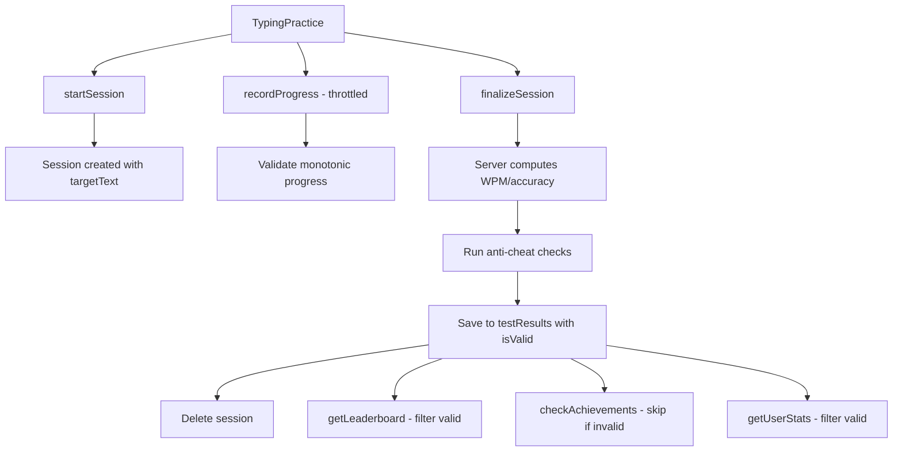

# Anti-cheat validity + invalid tagging

## Goals

- Make results server-authoritative with minimal server load (no per-keystroke logging).
- Persist `isValid` on each test result, allow admin override.
- Exclude invalid results from leaderboard, achievements, streaks, and aggregated stats.
- Display an `UNVERIFIED` chip in the Test Type column and test detail view.
- Provide a smooth UX that doesn't penalize legitimate users for edge cases.

## Validation thresholds

Define constants in [`convex/lib/antiCheatConstants.ts`](convex/lib/antiCheatConstants.ts):

| Threshold | Value | Rationale |

|-----------|-------|-----------|

| `MAX_WPM` | 300 | World record is ~216 WPM sustained; 300 allows headroom |

| `MAX_CHARS_PER_SECOND` | 25 | 300 WPM ÷ 5 chars/word = 60 words/min × 5 = 25 chars/sec |

| `MIN_PROGRESS_EVENTS` | 3 | Minimum heartbeats to prove real-time typing |

| `MIN_EVENTS_PER_DURATION` | `duration / 10` | For time mode, scale with test length |

| `TIME_MODE_TOLERANCE_SEC` | 2 | Allow 2s network latency tolerance |

| `MAX_BURST_CHARS` | 50 | Max chars between progress events (detects paste) |

| `SESSION_TTL_MS` | 600000 | 10 minutes - sessions older than this are expired |

## Mode-specific validation rules

| Mode | Completion Trigger | Server Validation |

|------|-------------------|-------------------|

| `time` | Timer expires | `serverElapsed >= (duration - TIME_MODE_TOLERANCE_SEC)` |

| `words` | Word target reached | `wordCount >= wordTarget` |

| `quote` | All text typed | `typedText.length === targetText.length` |

| `zen` | User ends manually | Relaxed: only check `MIN_PROGRESS_EVENTS` |

| `preset` | All text typed | `typedText.length === targetText.length` |

## Proposed flow (lightweight live session)



## Implementation plan

### 1. Schema updates

**Update [`convex/schema.ts`](convex/schema.ts):**

```typescript
// Add to testResults table
isValid: v.optional(v.boolean()), // undefined = legacy (treated as valid)
invalidReason: v.optional(v.string()), // For debugging/admin review

// New typingSessions table
typingSessions: defineTable({
  userId: v.id("users"),
  settings: v.object({
    mode: v.string(),
    duration: v.optional(v.number()),
    wordTarget: v.optional(v.number()),
    difficulty: v.string(),
    punctuation: v.boolean(),
    numbers: v.boolean(),
  }),
  targetText: v.string(),
  createdAt: v.number(),
  startedAt: v.optional(v.number()), // Set on first recordProgress
  lastEventAt: v.number(),
  eventCount: v.number(),
  lastTypedLength: v.number(), // For monotonic validation
  maxCharsPerSecond: v.number(),
  maxBurstChars: v.number(),
})
  .index("by_user", ["userId"])
  .index("by_created_at", ["createdAt"]), // For cleanup queries
```

### 2. Server-side session management

**Create [`convex/lib/antiCheatConstants.ts`](convex/lib/antiCheatConstants.ts):**

- Export all threshold constants from the table above.

**Create [`convex/lib/computeStats.ts`](convex/lib/computeStats.ts):**

- Mirror the client's `computeStats` logic from `TypingPractice.tsx`.
- Export `computeStats(typedText, targetText)` for server-side accuracy calculation.
- Export `computeWordResults(typedText, targetText)` for word-level stats.

**Create [`convex/typingSessions.ts`](convex/typingSessions.ts):**

```typescript
// startSession(userId, settings, targetText)
// - Create session with initial values
// - Return sessionId

// recordProgress(sessionId, typedTextLength, timestamp?)
// - Validate session exists and belongs to user
// - Validate monotonic progress: typedTextLength >= lastTypedLength
// - Calculate charsDelta = typedTextLength - lastTypedLength
// - Calculate timeDelta from server timestamps
// - Update maxCharsPerSecond, maxBurstChars, eventCount
// - Set startedAt on first event
// - Reject if charsDelta > MAX_BURST_CHARS (potential paste)

// finalizeSession(sessionId, typedText)
// - Fetch session, validate ownership
// - Compute server elapsed time: now - startedAt
// - Compute WPM: (typedText.length / 5) / (serverElapsed / 60000)
// - Compute accuracy using computeStats(typedText, targetText)
// - Run anti-cheat validation (see below)
// - Save to testResults with isValid and invalidReason
// - Delete the session
// - Return { wpm, accuracy, isValid, invalidReason, ...stats }
```

**Anti-cheat validation logic in `finalizeSession`:**

```typescript
function validateSession(session, serverElapsed, computedWpm, typedText) {
  const reasons: string[] = [];
  const { mode, duration, wordTarget } = session.settings;
  
  // 1. Check minimum progress events
  const minEvents = mode === "time" 
    ? Math.max(MIN_PROGRESS_EVENTS, Math.floor(duration / 10))
    : MIN_PROGRESS_EVENTS;
  if (session.eventCount < minEvents) {
    reasons.push(`Too few progress events: ${session.eventCount} < ${minEvents}`);
  }
  
  // 2. Check WPM ceiling
  if (computedWpm > MAX_WPM) {
    reasons.push(`WPM exceeds maximum: ${computedWpm} > ${MAX_WPM}`);
  }
  
  // 3. Check burst characters (paste detection)
  if (session.maxBurstChars > MAX_BURST_CHARS) {
    reasons.push(`Burst chars exceeded: ${session.maxBurstChars} > ${MAX_BURST_CHARS}`);
  }
  
  // 4. Mode-specific validation
  if (mode === "time") {
    const expectedMs = duration * 1000;
    const toleranceMs = TIME_MODE_TOLERANCE_SEC * 1000;
    if (serverElapsed < expectedMs - toleranceMs) {
      reasons.push(`Time mode completed too fast: ${serverElapsed}ms < ${expectedMs - toleranceMs}ms`);
    }
  }
  
  if (mode === "words" && wordTarget) {
    const wordCount = typedText.trim().split(/\s+/).length;
    if (wordCount < wordTarget) {
      reasons.push(`Word count insufficient: ${wordCount} < ${wordTarget}`);
    }
  }
  
  if ((mode === "quote" || mode === "preset") && typedText.length < session.targetText.length) {
    reasons.push(`Text incomplete: ${typedText.length} < ${session.targetText.length}`);
  }
  
  return {
    isValid: reasons.length === 0,
    invalidReason: reasons.length > 0 ? reasons.join("; ") : undefined,
  };
}
```

### 3. Session lifecycle management

**Abandoned session cleanup:**

Create a Convex scheduled function in [`convex/crons.ts`](convex/crons.ts):

```typescript
// cleanupExpiredSessions - runs every 5 minutes
// - Query sessions where createdAt < (now - SESSION_TTL_MS)
// - Delete expired sessions in batches
// - Log cleanup stats for monitoring
```

**Handle page refresh:**

- When `startSession` is called, check if user has an existing session.
- If session exists and is < 30 seconds old, return existing sessionId (resume).
- If session is older, delete it and create a new one.

**Network failure handling (client-side):**

- If `recordProgress` fails, retry up to 3 times with exponential backoff.
- If `finalizeSession` fails, store result locally and retry on next app load.
- Show user a "Syncing..." indicator during retries.

### 4. Apply `isValid` filtering across backend

**Update [`convex/testResults.ts`](convex/testResults.ts):**

- Remove direct `saveResult` mutation (replace with `finalizeSession` flow).
- Keep a `saveResultLegacy` for backward compatibility during rollout.
- In `getLeaderboard`: filter to `isValid !== false`.
- In `getUserStats`: filter aggregates to `isValid !== false`, but show all results in history.

**Update [`convex/achievements.ts`](convex/achievements.ts):**

- Filter `allResults` to valid only when computing achievement progress.
- Skip awarding achievements when the current test `isValid === false`.

**Update [`convex/streaks.ts`](convex/streaks.ts):**

- Only call `updateStreak` when `isValid !== false`.

### 5. Frontend session integration

**Update [`src/components/typing/TypingPractice.tsx`](src/components/typing/TypingPractice.tsx):**

```typescript
// Add session state
const [sessionId, setSessionId] = useState<Id<"typingSessions"> | null>(null);
const lastProgressRef = useRef<number>(0);

// On test start (when isRunning becomes true and user is signed in):
// - Call startSession mutation
// - Store returned sessionId

// Throttled progress reporting:
// - Every 2 seconds OR every 50 characters (whichever comes first)
// - Call recordProgress(sessionId, typedText.length)
// - Track lastProgressRef to calculate deltas

// On finish (in finishSession callback):
// - If sessionId exists: call finalizeSession(sessionId, typedText)
// - Use returned server-computed stats for display
// - If no session (guest user): show results but don't save

// Handle errors:
// - If startSession fails: allow typing but mark result as unverifiable
// - If recordProgress fails: retry silently, don't interrupt user
// - If finalizeSession fails: show error, offer retry button
```

**Progress reporting throttle logic:**

```typescript
const PROGRESS_INTERVAL_MS = 2000;
const PROGRESS_CHAR_THRESHOLD = 50;

useEffect(() => {
  if (!isRunning || !sessionId || isFinished) return;
  
  const charsSinceLastReport = typedText.length - lastProgressRef.current;
  
  const shouldReport = 
    charsSinceLastReport >= PROGRESS_CHAR_THRESHOLD ||
    (Date.now() - lastReportTime) >= PROGRESS_INTERVAL_MS;
  
  if (shouldReport && charsSinceLastReport > 0) {
    recordProgressMutation({ sessionId, typedTextLength: typedText.length });
    lastProgressRef.current = typedText.length;
  }
}, [typedText, isRunning, sessionId, isFinished]);
```

### 6. UI updates for unverified tagging

**Update [`src/components/auth/StatsModal.tsx`](src/components/auth/StatsModal.tsx):**

```typescript
// Extend TestResult type
interface TestResult {
  // ... existing fields
  isValid?: boolean;
  invalidReason?: string;
}

// In getTestTypeChips, add:
if (result.isValid === false) {
  chips.push({
    label: "UNVERIFIED",
    color: theme.incorrectText,
    title: "This test couldn't be verified for leaderboard eligibility",
  });
}

// Summary stats should use valid-only aggregates
// History table shows all results with visual distinction for invalid
```

**Update [`src/components/typing/TypingPractice.tsx`](src/components/typing/TypingPractice.tsx) results screen:**

```typescript
// When isValid === false, show info card above Save/Next buttons:
{isValid === false && (
  <div 
    className="w-full max-w-4xl mx-auto mb-6 p-4 rounded-lg border"
    style={{ 
      backgroundColor: `${theme.incorrectText}10`,
      borderColor: `${theme.incorrectText}30`,
    }}
  >
    <div className="flex items-center gap-3">
      <InfoIcon style={{ color: theme.incorrectText }} />
      <div>
        <div className="font-medium" style={{ color: theme.incorrectText }}>
          Test Not Verified
        </div>
        <div className="text-sm" style={{ color: theme.defaultText }}>
          This result won't count toward leaderboards or achievements. 
          Tests must be completed in real-time to be verified.
        </div>
      </div>
    </div>
  </div>
)}
```

**Update [`src/components/auth/LeaderboardModal.tsx`](src/components/auth/LeaderboardModal.tsx):**

- Add subtle footer text: "Leaderboard shows verified tests only"

### 7. Guest user handling

For users who complete a test then sign in:

**Option A (simpler):** Guest tests are never verified - show a prompt encouraging sign-in before starting.

**Option B (better UX):** Store session data in localStorage:

```typescript
// In TypingPractice, when not signed in:
// - Generate a temporary sessionId (UUID)
// - Store progress events in localStorage
// - On sign-in, if pending session exists:
//   - Call a special mutation to validate and save the result
//   - Clear localStorage
```

Recommend starting with Option A and iterating to Option B based on user feedback.

## Key files to touch

| File | Changes |

|------|---------|

| [`convex/schema.ts`](convex/schema.ts) | Add `isValid`, `invalidReason` to testResults; add `typingSessions` table |

| [`convex/lib/antiCheatConstants.ts`](convex/lib/antiCheatConstants.ts) | New - threshold constants |

| [`convex/lib/computeStats.ts`](convex/lib/computeStats.ts) | New - shared stats computation |

| [`convex/typingSessions.ts`](convex/typingSessions.ts) | New - session mutations |

| [`convex/crons.ts`](convex/crons.ts) | New or update - session cleanup job |

| [`convex/testResults.ts`](convex/testResults.ts) | Add `isValid` filtering, deprecate direct save |

| [`convex/achievements.ts`](convex/achievements.ts) | Filter to valid results only |

| [`convex/streaks.ts`](convex/streaks.ts) | Skip invalid tests |

| [`src/components/typing/TypingPractice.tsx`](src/components/typing/TypingPractice.tsx) | Session lifecycle, progress reporting, UI changes |

| [`src/components/auth/StatsModal.tsx`](src/components/auth/StatsModal.tsx) | UNVERIFIED chip, valid-only aggregates |

| [`src/components/auth/LeaderboardModal.tsx`](src/components/auth/LeaderboardModal.tsx) | Footer text |

## Migration strategy

### Phase 1: Deploy schema + shadow mode

1. Deploy schema changes with `isValid` field.
2. Deploy `typingSessions` table and mutations.
3. Run validation logic but always set `isValid: true` (shadow mode).
4. Log all validation failures to monitor false positive rate.

### Phase 2: Enable validation

1. After 1 week of shadow mode data, tune thresholds if needed.
2. Enable actual `isValid` flagging.
3. Backfill existing results with `isValid: true` (they're legacy, give benefit of doubt).

### Phase 3: Monitor and iterate

1. Track metrics: invalid rate, user complaints, leaderboard changes.
2. Add admin dashboard to review flagged tests.
3. Consider appeal mechanism if false positive rate > 1%.

## Testing strategy

### Unit tests

- Test `computeStats` matches client implementation.
- Test validation logic with edge cases (exactly at thresholds, off-by-one).
- Test mode-specific validation for each mode.

### Integration tests

- Test full session flow: start → progress → finalize.
- Test session cleanup removes expired sessions.
- Test concurrent sessions from same user.

### Manual testing checklist

- [ ] Complete a normal test - should be valid
- [ ] Complete a test very fast (< 5 seconds) - should be invalid
- [ ] Paste text during test - should be invalid
- [ ] Refresh mid-test and continue - should handle gracefully
- [ ] Close browser mid-test - session should be cleaned up
- [ ] Sign in after completing test as guest - appropriate messaging

## Monitoring

Add logging for:

- All validation failures with `invalidReason`
- Session creation/completion rates
- Cleanup job statistics
- P95 latency for `recordProgress` and `finalizeSession`

Consider a simple admin query to review recent invalid tests:

```typescript
// convex/admin.ts
export const getRecentInvalidTests = query({
  args: { limit: v.number() },
  handler: async (ctx, { limit }) => {
    return await ctx.db
      .query("testResults")
      .filter((q) => q.eq(q.field("isValid"), false))
      .order("desc")
      .take(limit);
  },
});
```

## Notes / assumptions

- Keep anti-cheat lightweight: no per-keystroke logging; only periodic snapshots + server timestamps.
- Backward compatibility: treat missing `isValid` as valid when reading old data.
- Admin can flip `isValid` directly in the DB without breaking aggregates/leaderboard logic.
- User-facing language uses "unverified" rather than "invalid" or "cheating detected" to avoid accusations.
- The goal is to prevent leaderboard/achievement gaming, not to catch every possible cheat.
- False negatives (cheaters who pass) are acceptable; false positives (legitimate users flagged) are not.