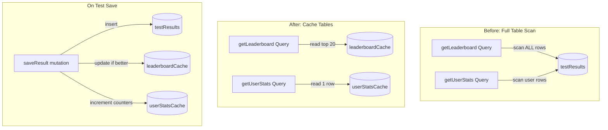

# Convex Materialized Views for Query Optimization

## Problem

Two queries are causing excessive reads by scanning the entire `testResults` table:

1. `**getLeaderboard**` ([convex/testResults.ts](convex/testResults.ts) line 370) - Calls `.collect()` on ALL test results, then filters/aggregates in memory. Called 3x per leaderboard page load.
2. `**getUserStats**` ([convex/testResults.ts](convex/testResults.ts) line 233) - Fetches all of a user's test results to compute aggregates. Called frequently on stats pages.

## Solution: Materialized View Tables

Add two cache tables that store pre-computed aggregates, updated incrementally when test results change.




---

## Implementation

### 1. Add Cache Tables to Schema

Add to [convex/schema.ts](convex/schema.ts):

```typescript
// Pre-computed user stats cache (one row per user)
userStatsCache: defineTable({
  userId: v.id("users"),
  totalTests: v.number(),
  totalWpm: v.number(),        // Sum for computing average
  bestWpm: v.number(),
  totalAccuracy: v.number(),   // Sum for computing average
  totalTimeTyped: v.number(),
  totalWordsTyped: v.number(),
  updatedAt: v.number(),
}).index("by_user", ["userId"]),

// Pre-computed leaderboard entries (one row per user per time range)
leaderboardCache: defineTable({
  userId: v.id("users"),
  timeRange: v.union(v.literal("all-time"), v.literal("week"), v.literal("today")),
  bestWpm: v.number(),
  bestWpmAt: v.number(),       // Timestamp of when this score was achieved
  username: v.string(),
  avatarUrl: v.optional(v.string()),
  updatedAt: v.number(),
})
  .index("by_time_range_wpm", ["timeRange", "bestWpm"])
  .index("by_user_time_range", ["userId", "timeRange"]),
```

### 2. Create Internal Cache Update Functions

Create new file [convex/statsCache.ts](convex/statsCache.ts):

`**updateUserStatsCache**` - Called after `saveResult`:

- Get existing cache row for user (or create new)
- Increment counters: `totalTests++`, `totalWpm += newWpm`, etc.
- Update `bestWpm` if new score is higher
- Single read + single write per test completion

`**updateLeaderboardCache**` - Called after `saveResult`:

- Only process if accuracy >= 90% (leaderboard requirement)
- For each time range (all-time, week, today):
  - Check if user's new score beats their cached best
  - If yes, update the cache entry
- Reads 3 rows max, writes 1-3 rows only when scores improve

`**rebuildUserStatsCache**` - One-time migration:

- For each user, scan their test results once
- Populate the `userStatsCache` table
- Run once, then incremental updates handle the rest

`**rebuildLeaderboardCache**` - Scheduled job:

- Run daily at midnight to refresh "today" entries
- Prune expired "today" entries older than 24h
- Optionally refresh "week" entries that have aged out

### 3. Update Existing Mutations

Modify [convex/testResults.ts](convex/testResults.ts) `saveResult`:

```typescript
// After inserting test result and updating streak/achievements...

// Update user stats cache (always)
await ctx.runMutation(internal.statsCache.updateUserStatsCache, {
  userId: user._id,
  wpm: args.wpm,
  accuracy: args.accuracy,
  duration: args.duration,
  wordCount: args.wordCount,
});

// Update leaderboard cache (only if accuracy >= 90%)
if (args.accuracy >= 90) {
  await ctx.runMutation(internal.statsCache.updateLeaderboardCache, {
    userId: user._id,
    wpm: args.wpm,
    createdAt,
    username: user.username,
    avatarUrl: user.avatarUrl,
  });
}
```

### 4. Update Query Functions

`**getLeaderboard**` - Change from:

```typescript
const allResults = await ctx.db.query("testResults").collect();
// ... filter and aggregate
```

To:

```typescript
const entries = await ctx.db
  .query("leaderboardCache")
  .withIndex("by_time_range_wpm", (q) => q.eq("timeRange", args.timeRange))
  .order("desc")
  .take(limit);
```

**Reads: 20 rows instead of entire table**

`**getUserStats**` - Change from:

```typescript
const allResults = await ctx.db
  .query("testResults")
  .withIndex("by_user", (q) => q.eq("userId", user._id))
  .collect();
// ... aggregate in memory
```

To:

```typescript
const cachedStats = await ctx.db
  .query("userStatsCache")
  .withIndex("by_user", (q) => q.eq("userId", user._id))
  .first();

if (cachedStats) {
  return {
    totalTests: cachedStats.totalTests,
    averageWpm: Math.round(cachedStats.totalWpm / cachedStats.totalTests),
    bestWpm: cachedStats.bestWpm,
    // ... etc
  };
}
```

**Reads: 1 row instead of all user's tests**

### 5. Handle Result Deletion

Modify `deleteResult` to update caches:

- Decrement user stats counters
- If deleted result was user's best WPM, recalculate from remaining results
- Update leaderboard cache if necessary

### 6. One-Time Migration

Create a migration script to populate cache tables from existing data:

```typescript
// convex/migrations.ts
export const backfillUserStatsCache = internalMutation(async (ctx) => {
  const users = await ctx.db.query("users").collect();
  for (const user of users) {
    await ctx.runMutation(internal.statsCache.rebuildUserStatsCacheForUser, {
      userId: user._id,
    });
  }
});
```

---

## Read Reduction Analysis


| Query                      | Before                | After            | Reduction |
| -------------------------- | --------------------- | ---------------- | --------- |
| `getLeaderboard` (3 calls) | 3 x (all testResults) | 3 x 20 rows = 60 | ~99%      |
| `getUserStats`             | all user's tests      | 1 row            | ~99%      |
| `saveResult` overhead      | 0                     | +2 cache updates | Minimal   |


---

## Considerations

- **Eventual consistency**: Cache is updated in the same transaction as the test result, so it stays consistent
- **Deletion handling**: Requires recalculating from remaining results if best score is deleted
- **Time-based leaderboards**: "today" and "week" caches need periodic cleanup via scheduled function
- **No schema migration needed**: New tables can be added without affecting existing data

